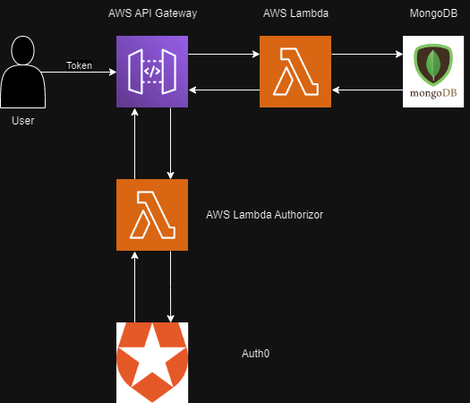

# Backend


## Backend Workflow



## APIs


## Database Models


## Dependencies
* Python 3.11
* [AWS SAM CLI](https://aws.amazon.com/serverless/sam/)
* Pipenv
* make 
* Docker

## Local Testing
Ensure Docker is running locally.
```
make unit_tests
```